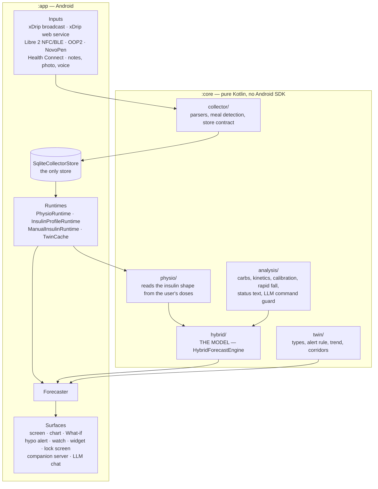

# DiaPilot architecture — the ten-minute version

A map of what the code does now: who writes the input, who computes, who reads
the output. It is deliberately short. The long-form material lives elsewhere:

| For | Read |
|---|---|
| why the forecast has this shape, and every knob | [`forecast-engine.md`](forecast-engine.md) |
| how the insulin curve and ISF are measured | [`insulin-model.md`](insulin-model.md) |
| open findings, by number, with file references | [`audit.md`](audit.md) |
| what was removed and why, dated audit logs | [`history.md`](history.md) |
| the plan, two tracks | [`roadmap.md`](roadmap.md) |

Size (`src/main` only, no tests, `wc -l` over `*.kt`): `core` about 25.4k lines
across 108 files, `app` about 43.2k across 123; `tools/accuracy` under 1k across 5.

---

## 1. Two modules, one boundary



**`:core` has zero `android` imports across all 108 files.** Every number in
the forecast is computed there and is testable on the JVM without a phone
(909 unit tests in `:core`, 362 in `:app`, 38 in `:tools:accuracy` — counted
from the JUnit reports of one full run). The package graph is
almost a DAG — `collector ← analysis ← twin/hybrid ← physio ← api`, with one
`analysis ↔ hybrid` cycle left.

**`:app` is the harness**: storage, the foreground collection service, the
WorkManager poller, NFC and BLE, Health Connect, notifications, the widget, the
Compose UI, the Claude API client, companion sync. It holds the platform debt —
no ViewModel, no DI, one recompute-everything state — which is findings A1–A8
in [`audit.md`](audit.md).

**`:app` is built in two editions**, `oss` and `store`, from this same source.
`Edition.kt` is the only branching point: two booleans, `prospective` and
`sensorDirect`, and nothing else reads the flavor. Where the line runs, what
each gate is, and why the store edition must read as *absent* rather than as
zero is [`editions.md`](editions.md). `:core` knows nothing about editions.

---

## 2. Where the model lives

The forecast engine is `core/hybrid/HybridForecastEngine.kt`. It reads no
database, no clock, no preferences, and no glucose after the anchor it is
handed, which is what makes blind replay and Python/Kotlin parity testable.
The `:app` side that assembles its inputs from the store as they were known at
the anchor and hands the result to the ledger is `data/PhysioForecastBridge.kt`
(`PhysioForecastBridge.forecast`, called from `Forecaster`; the installed model
sits in `PhysioForecastRegistry`). Both used to be called `HybridShadow*`, a
name from the bench era when this arm ran beside a legacy engine; the ledger
tag it writes, `forecast-v11-kotlin-shadow-13-…`, keeps the word because rows
already stored are addressed by it. Every `:app` engine is built through
`core/hybrid/PhysioEngineFactory.kt` (`physioForecastEngine`), which resolves
the model's own `*Override` knobs — the one deliberate exception is the
`physio = false` What-if arm inside the bridge, kept so `WhatIfArmTest` can show
the arms differ.

**One engine, no fallback.** The legacy twin engine was removed. When physio is
unavailable, `Forecaster` returns null and logs an error rather than drawing a
line from a different model: a line from another model looks normal, silence is
noticeable. What survives in `core/twin` is vocabulary and rules, not an engine
— `ForecastTypes.kt`, `HypoAlert.kt` / `HypoAlertLogic.kt` (the alert rule
reads points, never the engine), `Momentum.kt`, `RegimeV1.kt`,
`RegimeCorridor.kt`, `Simulator.kt`, `ActivityEffect.kt`,
`ForecastHealthV1.kt`.

The person model itself is a portable artifact: the runtime contains no
patient-specific defaults, and the bundled files under
`app/src/main/assets/models/` describe a synthetic example person.

---

## 3. Data flow, one step at a time

```
sensor / pen / watch / notes
        ↓  (collector parsers)
SqliteCollectorStore                    ← the only store
        ↓
MeterCalCache / MinuteCalCache / MeasurementStream   ← calibration
        ↓
TwinCache                               ← corpus assembly, deconvolution
        ↓
PhysioRuntime → PhysioArtifactV1        ← the applied model for a given minute
        ↓
Forecaster → PhysioForecastBridge → HybridForecastEngine
        ↓
screen · What-if · hypo alert · watch · widget · ledger
```

**Calibration is three mechanisms, easy to confuse.** `MeterCalCache` is the
meter-to-sensor lens (slope, intercept, a decaying transient, from
`core/analysis/MeterCal.kt`). `MinuteCalCache` bridges the per-minute OOP2
stream to the primary one. `MeasurementStream` enforces the one-calibration
rule: a measurement reads from exactly one stream. That rule does not apply to
the live forecast anchor, which always takes the freshest reading from any
channel.

**A floor and a ceiling on glucose.** Readings outside 1.0…35.0 never leave the
store, and the forecast never drops below `HYBRID_FLOOR_MMOL` = 2.0 while
counting how many points hit the floor (`floorClampedPoints`) — hitting the
floor is a model failure, not a hypo. The mechanism exists because a mg/dL
value was once written into the mmol column, and the trend extrapolated to a
physically implausible low.

---

## 4. Insulin

The order is strict, and it is an identifiability requirement, not a
preference: **insulin first**, on segments with no active meal, **then meal
against fixed insulin.**

| layer | file | role |
|---|---|---|
| per-segment timings | `core/physio/SegmentLandmarksV1.kt` | start / peak / end from every injection; `SegmentLandmarkReaderV1` is an object inside that file |
| profile assembly | `data/InsulinProfileRuntime.kt` | dose funnel → shape |
| the measured curve | `core/physio/PersonalInsulinCurveV1.kt` | the only path from landmarks to `person.insulin.actionCdfKnots` — one of four constructions, see below |
| ISF, a single door | `core/physio/ManualInsulinParamsV1.kt` + `data/ManualInsulinRuntime.kt` | hand-pinned, tier P1 |
| adaptive ISF | `core/physio/DailyBalanceIsfV1.kt` + `data/AdaptiveIsfRuntime.kt` | a daily balance, recomputed once a day |
| switch | `data/IsfSource.kt` | manual ⇄ adaptive, default MANUAL |
| episodes for fitting | `core/physio/FitEpisodeBuilderV1.kt` | one episode definition, shared by the bench and the device |

**Four constructions of the insulin curve coexist, and the forecast reads
one.** `HybridForecastEngine.insulinCdf` is the only function on the forecast
path, and it has two branches. With `actionCdfKnots` set on the person model —
which is where `PersonalInsulinCurveV1` (measured, through
`InsulinProfileRuntime` / `InsulinCurveRuntime`), `ManualInsulinRuntime`
(hand-entered) and `PhysioAutoFitV1` (fitted) all land — the stored knots are
interpolated as they are, for every dose size alike. Without knots the engine
falls back to the parametric two-triangle mixture from the artifact's
`onset / peak / short / tail` fields, and that fallback is the ONLY branch that
reads the dose (`tailWeightPerUnit`, audit M10; pinned by
`InsulinKnotsDoseIndependenceTest`). The bundled example person ships without
knots, so a fresh install runs the parametric branch until a curve is measured
or entered. The fourth construction never reaches the forecast: the OpenAPS
exponential in `core/analysis/Iob.kt` (`iobFraction`) is the kernel family
`ParametricKernel.kt` and `EpisodeKernelV1.kt` fit on the correction corpus,
and `iobUnits` in the same file — the population IOB — has no caller left in
`src/main`. "One curve for everything" was the intent behind
`PersonalInsulinCurveV1`; it is true of what reaches `person.insulin`, not of
the tree.

**The shape is measured; the amplitude is not.** Timings come from the user's
own doses, landmark by landmark. The ISF measurement pipeline was removed; the
applied ISF is entered by hand, with a daily balance shown beside it. See
[`insulin-model.md`](insulin-model.md) §3 and audit finding M8.

The applied value is read from the `APPLIED to model` log line, not from the
`configured` line — the latter shows what sits on the settings screen, and the
two can diverge.

---

## 5. Meals

**Amplitude is one formula:** `grams × globalFactor × calibration`. The dish
dictionary was removed, and so were learned per-dish curves. The starting value
comes from body weight, `core/analysis/CarbSensitivityPriorV1.kt`.

The weight-based CS is **applied**: `PhysioRuntime.foodDynamicsGlobalPriorV1`
is called with `Settings.weightKg`, and its median becomes the artifact's
`globalCs`, i.e. `food.globalFactor` in the model `Forecaster` runs. The order
is a hand-set override, then the weight-derived prior, then the synthetic
example person's 0.165 mmol/L per gram for an install that filled in neither.
The weight is part of the artifact cache key, so changing the field invalidates
the cached model (audit finding M4, closed in phaseB/b3).

The hand-set override tier is reachable only by an install that stored a value
under an older build: `carb_sens_override_mmol_per_g` still has no setter, and
`Settings.carbSensOverrideMmolPerG` cannot report "unset" because its default
IS the shipped constant. `Settings.storedCarbSensOverrideMmolPerG` is the
reader that can, and it is the one the chain uses.

**Timing is four layers, all keyed on composition, none on the dish name:**

1. `core/hybrid/CarbTrianglesV1.kt` — the population triangles (fast / medium /
   slow) every dish is mixed from;
2. `core/analysis/FoodKineticsV2.kt` — macro shares, physical form, fibre →
   mixture weights;
3. `core/hybrid/CarbAppearancePolicyV1.kt` — the caloric queue and the sieve:
   how many carbohydrates can leave the stomach at all;
4. `core/hybrid/MealClusterKineticsV1.kt` — meals close together share one pipe.

Grams come from `core/analysis/Carbs.kt` with provenance in
`core/collector/CarbEvidence.kt`; sessions from `core/analysis/MealSession.kt`;
dish recognition (`core/analysis/DishRecognitionV1.kt`) gives *what*, never
*how fast*.

**`FoodCurve`, `FingerprintKinetics` and `FoodConcepts` are not vestigial.** An
earlier pass flagged them for removal and that was wrong: they are the corpus
infrastructure `PhysioAutoFitV1` fits on.

**An open, measured defect: meal amplitude comes up short.** A ×1.25
multiplier with a fixed ISF moves the bias from 4.53 to 1.21 at h=180;
stretching the triangles makes it worse. Suspects are `carbSieving` at 0.65 and
`macroShare` at 0.48. Audit finding M3 records the identifiability catch: a
short insulin tail produces the same sign of error.

---

## 6. Basal, activity, input

| what | where |
|---|---|
| basal | `HybridBasalEvent` + `person.basal`, decorated by `PhysioV1.decorateBasal` |
| activity detection | `core/analysis/Activity.kt` (heart rate via Health Connect) |
| exposure | `core/analysis/ActivityExposureV1.kt`, `core/twin/ActivityEffect.kt` |
| source | `data/HealthConnectSync.kt` |
| night | `core/analysis/ActivityNight.kt` — observational only |
| meal composer | `ui/AnnotationComposer.kt` — the largest file in the project |
| structure acceptance | `ui/FoodStructureAcceptance.kt` + its core counterpart — the "no auto-teach" boundary |
| NovoPen | `nfc/PenNfcScanner.kt` + `core/pen/*` |
| barcodes | `data/OpenFoodFacts.kt` |
| history and dish library | `ui/LabelScreen.kt`, `ui/FoodLibrary.kt` |

---

## 7. Surfaces and alerts

| surface | file | fed by |
|---|---|---|
| main screen | `ui/TodayScreen.kt` ← `MainState.kt` | `Forecaster` |
| chart | `ui/GlucoseChart.kt` | `MainState` |
| watch | `collect/WatchServer.kt` | `Forecaster` |
| widget | `widget/BgWidget.kt` | `Forecaster` |
| lock screen | `collect/LockScreenOverlay.kt` | `GlucosePresentation` |
| companion app | `api/DiaForApi.kt`, `core/api/*` | the event journal |
| companion server | `collect/CompanionSync.kt` | `Forecaster` |
| settings | `ui/SettingsScreen.kt` | `data/Settings.kt` |
| data sources | `ui/DataSourcesScreen.kt` | `collect/DiagState` + the system services |
| alerts | `collect/AlertTick.kt` | every source, plus the 15-minute poll |
| diagnostics export | `diag/DiagnosticsReport.kt` → `diag/DiagnosticsBundle.kt` | `collect/DiagState`, the store, `TwinCache.peek()`, `diag/DiagLog` |

Which of these a build actually reaches is the edition's business, not the
surface's — see [`editions.md`](editions.md).

| alert | file | input |
|---|---|---|
| hypo (predictive) | `collect/HypoAlertNotifier.kt` + `core/twin/HypoAlert.kt` | `Forecaster(recordAs="hypo_alert")` |
| hypo (observed), sustained low, sensor artifact | `collect/HypoAlertNotifier.kt` + `core/twin/HypoAlertLogic.kt` | the readings alone |
| sustained high | `collect/HypoAlertNotifier.kt` + `core/twin/SustainedHigh.kt` | `trustedHistory` |
| high (predicted) | `collect/HypoAlertNotifier.kt` + `core/twin/HypoAlert.kt` | `Forecaster` |
| rapid fall | `collect/RapidFallNotifier.kt` + `core/analysis/RapidFall.kt` | the per-minute stream, or the 5-minute grid |
| stream stalled | `collect/StreamStallNotifier.kt` | observation |
| "looks like you ate" | `collect/MealNotifier.kt` | `core/collector/MealDetect.kt` |

**Every one of them is evaluated from `collect/AlertTick.kt`, and from nowhere
else.** Until phase B they were evaluated from the tail of `CollectorService`'s
OOPAlgorithm2 minute receiver, which had one caller each — so a phone without
that third-party app collected, drew and answered the watch while no alarm could
fire (audit P7). The tick is called after the reading is stored by the xDrip
broadcast receiver, the OOP2 minute stream, the web-service poll, the Libre NFC
scan and a hand-entered fingerstick; `TreatmentsPollWorker` also calls it at the
end of every run whether or not anything arrived, which is the 15-minute
backstop for a phone whose only source is that poll and the only thing that
notices a stream that has gone quiet. It runs on one serial executor and
de-duplicates on the freshest reading's timestamp for five minutes, because two
sources delivering the same reading is the normal case — every accepted
broadcast triggers a catch-up poll whose `/sgv.json` answer contains it.

The tick decides nothing about an alert; every threshold, cooldown, snooze and
refire rule stays in the notifiers and the pure `:core` machines they call. It
owns two choices the caller has always owned. **Which series the rapid-fall
slope is fitted over**: the per-minute stream while it is live, otherwise a
thirty-minute window on the five-minute grid, because `detectRapidFall`'s
ten-minute default can never hold the five points it asks for at that cadence —
the slope threshold and the twenty-minute projection are the defaults either
way. And **which sentence the stall notification carries**: "bring the phone to
the sensor" only where the app owns the sensor link. A backfill fires nothing
because the notifiers refuse a stale anchor, not because the tick filters
anything — `HypoAlertNotifier` returns on an anchor older than ten minutes
before it writes any state, so a 14-day `/sgv.json` backfill opens no episode
and spends no dextrose snooze.

**Where a screen gets its store: `AppGraph.kt`.** `MainActivity` builds one
`AppGraph` and publishes it through `LocalAppGraph`, so no composable calls
`Stores.get(context)` any more — `git grep "Stores.get"` over `app/.../ui` is
empty, and the root screens go through the graph too. The graph resolves the
handle on every read rather than holding it, because a restore closes the
process-wide one. Everything outside a composition — services, workers,
receivers, the widget — still reaches for `Stores` directly. `Settings` and
the `*Runtime` objects are still static; audit finding A1 is only partly
closed.

**What-if and the main line compute from the same model.** They once did not:
`updateWhatIf(..., physio = false)` defaulted the arm flag off, the profile fell
through to the legacy slot, and the screen picked up a different kernel with a
different ISF. `WhatIfArmTest` pins it, and the `physio` parameter no longer has
a default — that default *was* the defect.

**Why nothing is arriving: `collect/DataSources.kt` and `ui/DataSourcesScreen.kt`.**
The collection chain has thirteen links that fail quietly on a phone that is
not the maintainer's — xDrip and its glucose broadcast, its web service,
Nightscout, OOPAlgorithm2, the own-BLE link, the battery policy, the
notification permission, exact alarms, the collector service, Health Connect,
the overlay grant, NFC (audit P6); eleven of them in the store edition, which
has no path to the two sensor-direct ones. A fourteenth row leads the screen and
is not a link: **Alerts** states whether an alarm can fire right now and, when
it cannot, which of four reasons it is — notifications blocked, both alerts
switched off, no reading yet, or a stalled stream (audit P7). It asks
`glucoseStalled`, the same threshold as the banner and the notification, and it
deliberately does not report whether a tick recently ran: every source drives
one and the periodic poll drives one regardless, so that is a property of the
build, and a stamp reset by a process restart would paint the row red on a
healthy phone. `dataSourceRows` turns what
`DiagState`, the preferences and the system services already know into one
status per link, plus the system screen that fixes it; it reads no clock, no
database and no Android API, so each row's state machine is pinned on the JVM.
The screen is a leaf reached from More and from the Today banner, and the
banner asks `glucoseStalled` — `StreamStallNotifier`'s own threshold over
state the screen already holds, not a second alert path. Sensor-direct rows
are absent rather than inert in the store edition.

**Two diagnostics exports, with opposite rules.**
`data/DiagnosticsExport.kt` writes `filesDir/diag.json` on every full model
build: the food corpus with every number in it, for the maintainer's own
bench. `diag/DiagnosticsReport.kt` writes a text file a tester is asked to
share after a week, and its rule is that no glucose value, dose, carbohydrate
amount or note text may appear — each is replaced by its unit and shape
(`bg <redacted> mmol/L`, `note <redacted, 34 chars>`), and timestamps leave as
ages in minutes. They are deliberately not one function with a flag.

Redaction is two layers. `diag/Redact.kt` formats every value the bundle knows
about; the same file's `medicalNumbers` then runs over the finished body and
rewrites any line still holding a fractional number or a number next to a
medical unit. The second layer exists because the log section carries lines
from ~40 call sites, so a helper missed at one of them costs a line of
diagnostics rather than a value. The property is asserted over a seeded state
in `DiagnosticsBundleTest`, not against a golden file — regenerating a golden
file is exactly the moment a leak would be accepted as the new expectation.

`diag/DiagLog.kt` is the ring those log lines come from: the collection chain
and the alerts write through it (`i`/`w`/`e` are kept, `d` goes to logcat
only), 24 h wide and capped at 800 lines. The model build ledger and the
`MainStatePerf` lines stay on `android.util.Log` — they are the maintainer's
bench instrument and would flood the window.

**The hypo threshold of 3.9 mmol/L against the alert's own trigger range of
4.4–4.5 mmol/L is an open question**, logged as tech debt. Audit finding M5 is
the related one: the horizon trust ramp shrinks food, background and drift but
not insulin, so the line is biased low exactly where the low alert decides.

### Settings that cannot be configured

The shape to watch for: a preference with a getter, a setter and **no call to
the setter anywhere** — a compile-time constant wearing a settings interface,
because code that reads it looks like a toggle the user can flip. `history.md`
recorded six boolean flags in that state; that table is a point-in-time note,
and none of the six is in that state now.

| flag | what it is now |
|---|---|
| `note_preferred_food` | removed — its only reader left with the legacy food layer |
| `activity_model_v2` | removed — now the parameter default (off) |
| `rough_neighbours` | removed — both mechanisms it chose between are gone |
| `note_anchored_food` | removed — stated as `true` at both call sites in `MainState` |
| `plausibility_gate` | a live switch, Settings → "Experimental", default **on**; `PlausibilityGateDefaultTest` pins the default |
| `marks_teach_model` | a live switch, default on (`SettingsScreen`), read at the gate in `TwinCache.get` |

Counted over every settings holder in `:app` — `data/Settings.kt`,
`PhysioTuning.kt`, `Units.kt`, `IsfSource.kt`, `FoodEraSettings.kt`,
`BackupRestore.kt`, `ManualInsulinRuntime.kt`, `i18n/AppLanguage.kt` — exactly
one setter has no caller left, and three getters read a key that nothing in the
tree writes. None of the four is a constant, because an earlier build could have
stored a value that a current install still reads:

| key | shape | why it stays a preference |
|---|---|---|
| `insulin_product_bolus` | `setBolusProduct` has no caller; `bolusProduct` has three readers | a name stored by an older build survives — `product()` still rewrites a Russian placeholder to its key, which is what says such values exist |
| `insulin_profile`, `insulin_dia_min` | getter, no setter | no screen sets either; a stored override from an older build still wins over the profile default |
| `carb_sens_mmol_per_10g` | getter, no setter | null on any install that never wrote it, and where it was written the value is the user's own number |

`carb_sens_override_mmol_per_g` is the deliberate exception: it has no setter
either, but its default *is* the shipped constant
(`CARB_SENS_OVERRIDE_DEFAULT`), and the argument for keeping it a setting rather
than a constant is written at the getter. That default is also why the key needs
two readers: `carbSensOverrideMmolPerG` answers "what is applied" and can never
answer null, while `storedCarbSensOverrideMmolPerG` answers "did somebody choose
this" — which is the question the carb-sensitivity priority chain asks (§5).

---

## 8. Ledgers

The ledger records what the app **displayed**, and nothing in it feeds the
model.

| row | file | what |
|---|---|---|
| `forecast_runs` | `data/ForecastLedger.kt` | header of a saved forecast: anchor, model tag, and `applied` — the ISF and insulin curve actually used. Only `main` and `hypo_alert` |
| `forecast_points` | same file | six horizons of the displayed line, at most one run every 5 minutes |
| What-if | `data/HybridWhatIfLedger.kt` | what would have happened with a different dose |
| retention | `data/LedgerRetention.kt` | screen 60 days, alert 7, runs 60, training snapshots 30 revisions |

It feeds three things: the first frame after a cold start instead of an empty
chart; a long press on the chart, which shows two lines and a strip with the
coefficients; and the acceptance check of whether a recomputation can reproduce
what the phone actually drew. Only the third is beyond walk-forward's reach.

`forecast_runs` with `consumer='hypo_alert'` is the one row that can answer
"did the model get it wrong, or was the app asleep" — a replay cannot, because
it computes from readings that get backfilled. It is deliberately not thinned.

---

## 9. What no longer exists

Names a reader will meet in comments, strings or older docs with nothing behind
them. The reasoning for each removal is in [`history.md`](history.md).

| removed | was |
|---|---|
| `core/twin/forecast` (the legacy engine) | the second forecast arm; there is no fallback now |
| `IsfEvidenceRuntime`, `CorrectionVerdictRuntime` + the review card | per-dose ISF measurement and its verdict surface |
| `ClosedEpisodeRuntime`, `ClosedCausalEpisodeV1` | the episode pipeline, about 1336 lines |
| `IsfDeviationRuntime`, `core/twin/Autosens.kt`, `core/twin/Deviation.kt` + `DeviationNotifier` | the off-model alert and its inputs |
| `forecast_scores`, `physio_parallel_runs` / `_scores`, `physio_shadow_candidates` | ledger tables; scores are recomputed on the spot, through the same calibration lens |
| `hypoAlertBacktest`, `HypoAlertReport` | replayed the alert rule through the removed engine |
| `core/analysis/SensorPreference.kt` | a sensor chooser |
| every CALLER of `core/analysis/iobUnits` | the population IOB on the shipped defaults; the function itself is still in `Iob.kt` (this table once listed it as removed — it was not), and `iobFraction` beside it is live as the fitting kernels' shape, see §4 |
| `ForecastComparisonRegistry` | the legacy-vs-physio pair slot of the bench; nothing wrote to it after the legacy arm went, nothing ever read it |
| the dish dictionary and learned per-dish curves | per-group and per-dish amplitude factors |
| `AnomalyDialog`, `ConceptsDialog`, `CardTitleWithHelp`, `FoodMemoryCard`, `KernelChart`, `LabeledMealRow` | about 1250 lines of composables nothing rendered |
| the research-era correction advisor | existed in the Python reference stage; the Android app never had one |

Parts of the research bench still ship inside the APK —
`PhysioExperimentalLedger`, the sweep knobs on `HybridRuntimeMetrics`, the
`Stage7–10` naming — and that is audit finding A3, not a removal. `HybridShadow`
and `HybridShadowRegistry` were not bench: they were the production forecast
path under a bench-era name, and are `PhysioForecastBridge` and
`PhysioForecastRegistry` now (§2); the ledger tag
`forecast-v11-kotlin-shadow-13-macro-queue-single-arm` is a stored identifier
and keeps the word.
